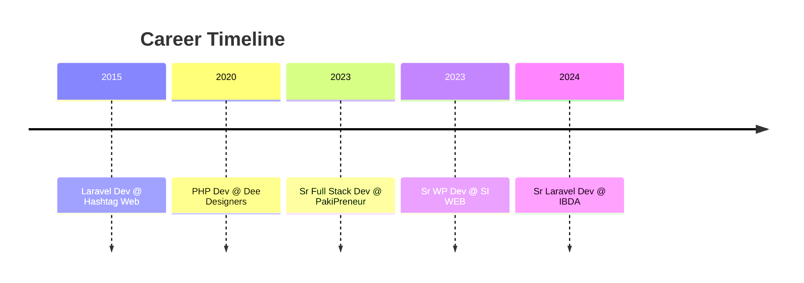

# 👋 Syed Muhammad Ali – Full Stack Developer

🚀 Passionate and results-driven Full Stack Developer with **4+ years** of hands-on experience in modern web technologies. From backend development with Laravel and PHP frameworks to mastering frontend ecosystems like **React.js**, **Next.js**, and **Angular**, I focus on delivering robust, scalable, and user-centric applications.

📍 Islamabad, Pakistan  
📫 [dev.alinaqvi@gmail.com](mailto:dev.alinaqvi@gmail.com) | [GitHub](https://github.com/techknowch) | [LinkedIn](https://www.linkedin.com/in/devalinaqvi/)

---

## 🧠 Skills

| Category              | Tools & Technologies                                       |
|-----------------------|------------------------------------------------------------|
| **Languages**         | PHP, JavaScript, TypeScript, HTML, CSS                     |
| **Frontend**          | React.js, Next.js, Angular, Tailwind CSS                   |
| **Backend**           | Laravel, CodeIgniter, Kohana, Koseven, Node.js             |
| **Databases**         | MySQL, MongoDB                                             |
| **CMS**               | WordPress, Moodle, OJS (Open Journal System)              |
| **DevOps**            | Git, GitHub, Linux, Shell Scripting                        |
| **Other**             | System Design, REST APIs, Agile & SDLC Methodologies       |

---

## 📊 Experience Snapshot

### 🕒 Career Timeline

### 💼 Experience Table

| Company           | Role                          | Duration            | Highlights                                         |
|-------------------|-------------------------------|---------------------|----------------------------------------------------|
| **IBDA**          | Sr Laravel Developer (Remote) | Aug 2024 – Present  | Moodle customization, Laravel backend improvements |
| **PakiPreneur**   | Sr Full Stack Developer       | Jan 2023 – Aug 2024 | MERN stack apps, custom dashboards                 |
| **SI WEB**        | Sr WordPress Developer        | Sep 2023 – Mar 2024 | WordPress project management                       |
| **Dee Designers** | PHP Developer                 | Dec 2020 – May 2022 | ERP modules, backend logic, frontend integration   |
| **Hashtag Web**   | Laravel Developer             | Jun 2015 – Sep 2015 | RESTful APIs, Laravel development                  |

---

## 🧩 Project Highlights

| Project           | Tech Stack         | Description                                                   | Link                                              |
|-------------------|--------------------|---------------------------------------------------------------|---------------------------------------------------|
| **Syntax Camp**   | Laravel + React.js | Online learning platform for programming courses              | [syntaxcamp.com](https://syntaxcamp.com)          |
| **Tailors.pk**    | Laravel + React.js | Tailor Finder with location based features                    | [tailors.pk](https://tailors.pk)                  |
| **Helpmeorder**   | MERN Stack         | Restaurant assistant: Scan menu, get budget-based suggestions | [helpmeorder.net](https://helpmeorder.net)        |
| **Sellyourphone** | PHP + JavaScript   | Instant gadget resale price estimator                         | [sellyourphone.ae](https://www.sellyourphone.ae/) |

---

## 🎓 Education

| Degree                       | Institution                       | Period               | CGPA  |
|------------------------------|-----------------------------------|----------------------|-------|
| BS Computer Science          | Virtual University, Pakistan      | Aug 2024 – Present   | —     |
| Associate Degree in CS       | University of Southern Punjab     | Feb 2022 – Jul 2024  | 3.2   |

---

## 📜 Certifications

- 🏅 JavaScript Algorithms and Data Structures – *Udemy*
- 🏅 Complete React Developer – *Udemy*

---

## 🌐 Languages

- **English** – Fluent  
- **Urdu** – Native

---

## 📈 GitHub Stats

  

---

📌 _This is a detailed summary to provide a comprehensive view of my technical background and contributions as of **June 2025**._
